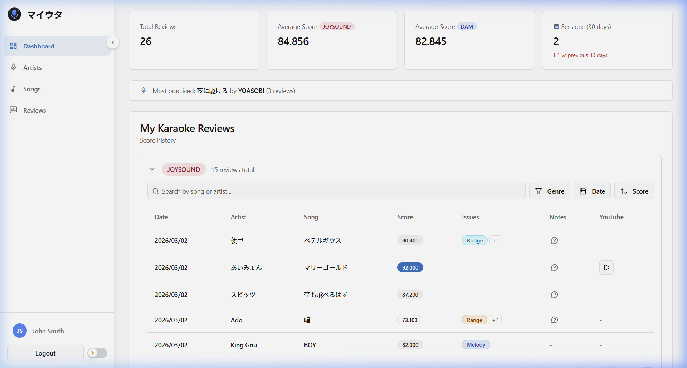

# マイウタ (MyUta)

[](https://github.com/steph-dm/MyUta/actions/workflows/ci.yml)
[](https://go.dev/)
[](https://goreportcard.com/report/github.com/steph-dm/MyUta/backend)

Karaoke score tracker for DAM and JOYSOUND machines. Log each session with scores, tag what went wrong (pitch, rhythm, timing, etc.), and track which songs you're improving on. Bilingual (English / Japanese).

<p align="center">
  
</p>

## What it does

- Log scores from DAM and JOYSOUND, with per-section issue tagging
- Trend charts per song to track progress
- OCR import: snap a photo of the score screen, auto-extracts the data
- Song library with genres and artist pages
- Built-in YouTube search to preview songs
- JSON export/import for backups
- EN / JA via i18next

## Stack

**Backend:** Go 1.26, GraphQL (gqlgen), PostgreSQL, Bun ORM
**Frontend:** React 19, TypeScript, Vite, Tailwind, shadcn/ui
**Auth:** JWT + bcrypt, refresh tokens, rate-limited login
**Infra:** Docker Compose, nginx, Railway
**APIs:** YouTube Data v3, Anthropic Claude (OCR)

## Project structure

```
backend/
  cmd/server/          → entrypoint
  internal/graph/      → GraphQL resolvers + dataloaders
  internal/service/    → business logic
  internal/storage/    → Postgres (Bun ORM)
  pkg/                 → auth, config, middleware, validator

frontend/src/
  pages/               → route-level components
  components/          → UI (charts, layout, forms, shadcn)
  hooks/               → hooks
  contexts/            → auth + theme providers
  i18n/                → EN/JA translations
```

## Getting started

Docker, Go 1.26+, and Node 20+.

```bash
# 1. env files
cp .env.example .env
cp backend/.env.example backend/.env

# 2. database
make db

# 3. backend (localhost:4000/graphql)
make dev-backend

# 4. frontend (localhost:3000)
make dev-frontend
```

Tables auto-migrate on first run. After seeding (`make seed`), log in with `taro.tanaka@example.com` / `password123`.

## Other commands

```bash
make test       # backend tests
make lint       # golangci-lint + tsc --noEmit
make build      # production builds
make up         # full stack via docker
```

## License

Copyright © 2026 steph-dm. All rights reserved.
